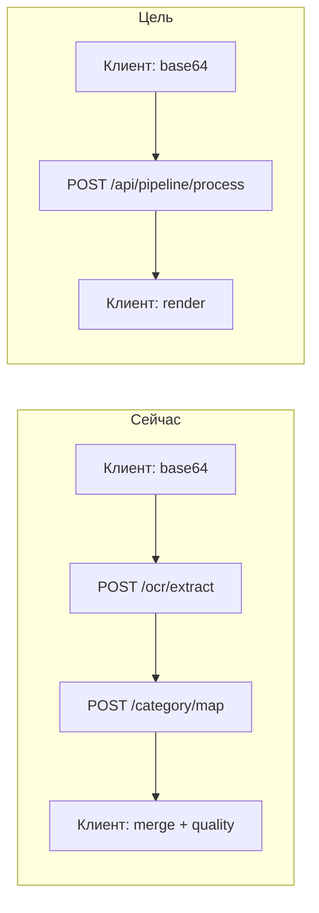

# Thin Client Pipeline — Implementation Plan

> **For agentic workers:** REQUIRED SUB-SKILL: Use superpowers:subagent-driven-development (recommended) or superpowers:executing-plans to implement this plan task-by-task. Steps use checkbox (`- [ ]`) syntax for tracking.
>
> **REQUIRED before Task 1:** Use superpowers:using-git-worktrees — вся реализация только в worktree, не в корневом checkout.
>
> **Status:** в работе — фаза 1a/1b в ветке `feature/thin-client-pipeline`.

**Goal:** Перенести доменную логику сборки матрицы кэшбэка с Next.js-клиента на FastAPI, сократив клиент до UI + препроцессинга изображений + транспорта.

**Architecture:** Новый pipeline-router в FastAPI объединяет OCR → category map → quality gate → merge в один stateless запрос. Клиент отправляет base64-изображение и опционально `current_matrix`; сервер возвращает готовую `CashbackMatrix`, `low_confidence`, `bank_offers`. Фаза 2 добавляет pre-computed `MatrixGroup[]` для results-screen. Логотипы провайдеров остаются на клиенте: сервер возвращает `provider_slug`, клиент резолвит URL через `lib/provider-logos.ts`.

**Tech Stack:** FastAPI, Pydantic v2, pytest (backend), Vitest (оставшиеся UI-тесты), существующие `ocr_service`, `mapper_service`, `market_split_map_service`.

**Background:** Сейчас клиент (`lib/api.ts`, `lib/matrix.ts`, `lib/market-comparison.ts`) выполняет merge, группировку и quality gate после двух отдельных вызовов `/api/ocr/extract` и `/api/category/map`. Это делает фронт «толстым» и дублирует бизнес-правила вне сервера.

---

## Current vs target



---

## File map

### New files (backend)

| File | Responsibility |
|------|----------------|
| `backend/services/category_label.py` | Python port: `normalize_category_label`, `format_category_label`, `labels_equivalent` |
| `backend/services/matrix_merge_service.py` | Port `mergeMappedItems`, `createProviderFromSubmission`, helpers |
| `backend/services/market_comparison_service.py` | Port `lib/market-comparison.ts` |
| `backend/services/matrix_group_service.py` | Port `groupMatrixRows`, `buildMarketGroupsAsMatrix` |
| `backend/services/pipeline_service.py` | Orchestration: OCR → map → quality → merge |
| `backend/routers/pipeline.py` | `POST /api/pipeline/process`, `POST /api/pipeline/batch` |
| `backend/tests/test_matrix_merge.py` | Port vitest cases from `lib/matrix-bank-display.test.ts` |
| `backend/tests/test_matrix_market_display.py` | Port vitest cases from `lib/matrix-market-display.test.ts` |
| `backend/tests/test_market_comparison.py` | Port vitest cases from `lib/market-comparison.test.ts` |
| `backend/tests/test_pipeline.py` | Integration: process endpoint, empty/unreliable rejection |

### Modified files

| File | Change |
|------|--------|
| `backend/schemas.py` | `CashbackMatrix`, `MatrixProvider`, `MatrixRow`, `ProcessSubmissionRequest/Response`, `MatrixGroup` |
| `backend/main.py` | Include `pipeline` router |
| `lib/api.ts` | Replace dual-call orchestration with single `postJson("/api/pipeline/process")` |
| `lib/matrix.ts` | Remove merged functions; keep UI-only helpers |
| `lib/types.ts` | Add `providerSlug?` on `MatrixProvider` if server returns slug without logo URL |
| `components/screens/processing-screen.tsx` | Call simplified `processSubmissionWithKeyTracking` |
| `components/screens/results-screen.tsx` | Phase 2: use `groups` from state if pre-computed |
| `lib/saved-matrices.ts` | No schema change; saved payload stays `MatrixState` |

### Keep on client (do not port)

| File / symbol | Reason |
|---------------|--------|
| `lib/image-utils.ts` | HEIC → JPEG, compression > 3 MB |
| `lib/api.ts` — `postJson`, `ApiError`, `getBackendUrl` | Transport |
| `lib/matrix.ts` — `getVisibleBankGroupRows`, `getVisibleMarketGroupRows`, `groupHasSubcategories`, `resolveMarketRowCategory`, `countProvidersInGroup` | UI presentation |
| `lib/cashback-data.ts` — `getRowTiers` | Badge colors |
| `lib/provider-logos.ts` | Logo URL resolution from slug + CDN |

---

## Task 0: Worktree + feature branch

**Files:** none (git only)

- [ ] **Step 1: Create worktree from `dev`**

```bash
cd /path/to/v0-cashback-aggregation-app
git fetch origin
git worktree add .worktrees/thin-client-pipeline -b feature/thin-client-pipeline origin/dev
cd .worktrees/thin-client-pipeline
pnpm install
cd backend && pip install -r requirements.txt
```

- [ ] **Step 2: Baseline — existing tests pass**

```bash
pnpm test
cd backend && pytest -q
```

Expected: vitest 3 files pass; backend pytest green.

---

## Task 1: Pydantic schemas for matrix + pipeline

**Files:**
- Modify: `backend/schemas.py`

- [ ] **Step 1: Add matrix types**

```python
class MatrixProvider(BaseModel):
    key: str
    name: str
    slug: str | None = None  # client resolves logo

class MatrixRow(BaseModel):
    category: str
    canonical_category: str | None = None
    parent: str | None = None
    bank_raw: str | None = None
    market_raw: str | None = None
    is_macro: bool = False
    reference_node_id: str | None = None
    reference_department: str | None = None
    reference_depth: int | None = None
    row_kind: Literal["anchor", "item"] | None = None
    rate_ranges: dict[str, dict[str, float]] | None = None
    rates: dict[str, float] = Field(default_factory=dict)

class ComparisonPart(BaseModel):
    store: str
    rate: float
    label: str
    node_id: str
    path: list[ReferencePathNode]

class CashbackMatrix(BaseModel):
    kind: Literal["bank", "market"]
    providers: list[MatrixProvider]
    rows: list[MatrixRow]
    market_parts: list[ComparisonPart] | None = None

class ProcessSubmissionRequest(BaseModel):
    image_base64: str = Field(..., min_length=1)
    mime_type: Literal["image/jpeg", "image/png", "image/jpg"] = "image/jpeg"
    kind: Literal["bank", "market"] = "bank"
    provider_name: str
    provider_slug: str | None = None
    current_matrix: CashbackMatrix | None = None

class LowConfidenceItem(BaseModel):
    provider_name: str
    raw_category: str
    unified_category: str
    confidence: float

class BankOfferItem(BaseModel):
    provider_name: str
    raw_category: str
    unified_category: str
    rate: float

class ProcessSubmissionResponse(BaseModel):
    matrix: CashbackMatrix
    low_confidence: list[LowConfidenceItem] = Field(default_factory=list)
    bank_offers: list[BankOfferItem] = Field(default_factory=list)
```

- [ ] **Step 2: Verify import**

```bash
cd backend && python -c "from schemas import ProcessSubmissionRequest; print('ok')"
```

Expected: `ok`

---

## Task 2: Port category label utilities

**Files:**
- Create: `backend/services/category_label.py`
- Create: `backend/tests/test_category_label.py`

- [ ] **Step 1: Write failing tests**

```python
# backend/tests/test_category_label.py
from services.category_label import format_category_label, labels_equivalent, normalize_category_label

def test_normalize_strips_punctuation():
    assert normalize_category_label("  Кафе, бары  ") == "кафе бары"

def test_labels_equivalent_case_insensitive():
    assert labels_equivalent("Для Детей", "для детей")

def test_format_category_label_title_case():
    assert format_category_label("для детей") == "Для Детей"
```

- [ ] **Step 2: Run test — expect FAIL**

```bash
cd backend && pytest tests/test_category_label.py -v
```

- [ ] **Step 3: Implement (mirror `lib/category-label.ts`)**

```python
# backend/services/category_label.py
import re

def normalize_category_label(label: str) -> str:
    cleaned = re.sub(r"[^\w\sа-яёА-ЯЁ]+", " ", label, flags=re.UNICODE)
    return " ".join(cleaned.lower().split())

def labels_equivalent(a: str, b: str) -> bool:
    return normalize_category_label(a) == normalize_category_label(b)

def format_category_label(label: str) -> str:
    words = normalize_category_label(label).split()
    return " ".join(w.capitalize() for w in words) if words else label.strip()
```

- [ ] **Step 4: Run test — expect PASS**

```bash
cd backend && pytest tests/test_category_label.py -v
```

---

## Task 3: Port `mergeMappedItems` (Phase 1a core)

**Files:**
- Create: `backend/services/matrix_merge_service.py`
- Create: `backend/tests/test_matrix_merge.py`
- Reference: `lib/matrix.ts` lines 29–228, `lib/matrix-bank-display.test.ts`

- [ ] **Step 1: Port vitest bank cases as pytest**

```python
# backend/tests/test_matrix_merge.py — excerpt
from services.matrix_merge_service import merge_mapped_items, MatrixProviderInput

ALFA = MatrixProviderInput(key="alfa", name="Альфа-Банк", slug=None)

def test_bank_retailer_under_macro_parent(detmir_mapped_item):
    matrix = merge_mapped_items(None, ALFA, [detmir_mapped_item], "bank")
    parents = {row.parent for row in matrix.rows}
    assert "Для Детей" in parents
    child_labels = [r.category for r in matrix.rows if r.bank_raw]
    assert any("Детский мир" in label for label in child_labels)
```

- [ ] **Step 2: Run — expect FAIL**

```bash
cd backend && pytest tests/test_matrix_merge.py -v
```

- [ ] **Step 3: Implement `merge_mapped_items`**

Port logic from `lib/matrix.ts`:
- `resolve_bank_row_key`, `row_key_from_existing`, `resolve_bank_display_label`
- Bank branch: macro rows, `bank_raw` child rows
- Market branch: accumulate `market_parts` (no row merge for market at this stage)
- Provider list merge/dedup by key

- [ ] **Step 4: Run — expect PASS**

```bash
cd backend && pytest tests/test_matrix_merge.py -v
```

- [ ] **Step 5: Port market display tests**

Copy scenarios from `lib/matrix-market-display.test.ts` into `backend/tests/test_matrix_market_display.py`; implement until green.

---

## Task 4: Quality gate + provider creation

**Files:**
- Create: `backend/services/pipeline_service.py`
- Modify: `backend/services/matrix_merge_service.py`

- [ ] **Step 1: Port `is_unreliable_mapping`**

```python
LOW_CONFIDENCE_THRESHOLD = 0.55

def is_unreliable_mapping(items: list[MappedItem]) -> bool:
    comparable = [i for i in items if not i.is_bank_offer]
    if not comparable:
        return False
    quality = [i for i in comparable if i.match_source != "reference_fallback"]
    if not quality:
        return False
    confidences = [i.confidence for i in quality]
    average = sum(confidences) / len(confidences)
    all_below = all(c < LOW_CONFIDENCE_THRESHOLD for c in confidences)
    mostly_fallback = (
        sum(1 for i in quality if i.unified_category == "Прочее") / len(quality) >= 0.5
    )
    return all_below or average < LOW_CONFIDENCE_THRESHOLD or mostly_fallback
```

- [ ] **Step 2: Implement `create_provider_from_submission`**

Server returns `MatrixProvider` with `key`, `name`, `slug` — **no logo URL**. Client enriches via `getProviderLogoBySlug(slug, kind)` in `processing-screen` or a thin `enrichMatrixLogos(matrix)` helper.

```python
def create_provider_from_submission(
    *,
    provider_name: str,
    provider_slug: str | None,
    existing_keys: set[str],
    existing_providers: list[MatrixProvider],
) -> MatrixProvider:
    # mirror find_matching_provider + build_provider_key from lib/matrix.ts
    ...
```

- [ ] **Step 3: Write pipeline unit test**

```python
def test_process_raises_empty_when_ocr_returns_no_items(monkeypatch):
    ...
```

---

## Task 5: Pipeline router (Phase 1b)

**Files:**
- Create: `backend/routers/pipeline.py`
- Modify: `backend/main.py`
- Create: `backend/tests/test_pipeline.py`

- [ ] **Step 1: Implement endpoint**

```python
# backend/routers/pipeline.py
router = APIRouter(prefix="/api/pipeline", tags=["pipeline"])

@router.post("/process", response_model=ProcessSubmissionResponse)
def pipeline_process(
    body: ProcessSubmissionRequest,
    request: Request,
) -> ProcessSubmissionResponse:
    return process_submission(body, request.app.state)
```

`process_submission` flow:
1. `ocr_service.extract(body.image_base64, body.mime_type, body.kind)`
2. If `items` empty → HTTP 422 `"На скриншоте не найдены категории кешбэка."`
3. `category_map(...)` via existing mappers
4. If `is_unreliable_mapping` → HTTP 422 unreliable message (same Russian copy as `OcrUnreliableError`)
5. `create_provider_from_submission` + `merge_mapped_items`
6. `collect_low_confidence` + `collect_bank_offers`
7. Return `ProcessSubmissionResponse`

- [ ] **Step 2: Register router in `main.py`**

```python
from routers import admin, category, ocr, pipeline
app.include_router(pipeline.router)
```

- [ ] **Step 3: Integration test with mocked OCR**

```bash
cd backend && pytest tests/test_pipeline.py -v
```

- [ ] **Step 4: Manual smoke**

```bash
# terminal 1
cd backend && uvicorn main:app --reload --port 8000
# terminal 2 — use a small base64 fixture from tests
curl -s -X POST http://localhost:8000/api/pipeline/process \
  -H 'Content-Type: application/json' \
  -d @backend/tests/fixtures/pipeline_request.json | jq .matrix.providers
```

---

## Task 6: Thin client — `lib/api.ts`

**Files:**
- Modify: `lib/api.ts`
- Create: `lib/enrich-matrix-logos.ts` (optional small helper)
- Modify: `lib/types.ts` — `MatrixProvider.slug?: string`
- Modify: `components/screens/processing-screen.tsx`

- [ ] **Step 1: Replace `processSubmission` body**

```typescript
export async function processSubmission(
  submission: SourceSubmission,
  existingKeys: Set<string>,
  currentMatrix: CashbackMatrix | null,
): Promise<ProcessSubmissionResult> {
  const { image_base64, mime_type } = await imageSrcToBase64(submission.screenshotSrc)

  const response = await postJson<ProcessSubmissionResponse>("/api/pipeline/process", {
    image_base64,
    mime_type,
    kind: submission.kind,
    provider_name: submission.providerName,
    provider_slug: submission.providerSlug,
    current_matrix: currentMatrix,
  })

  const matrix = enrichMatrixLogos(response.matrix)

  return {
    matrix,
    lowConfidenceItems: response.low_confidence.map((item) => ({
      providerName: item.provider_name,
      rawCategory: item.raw_category,
      unifiedCategory: item.unified_category,
      confidence: item.confidence,
    })),
    bankOfferItems: response.bank_offers.map((item) => ({
      providerName: item.provider_name,
      rawCategory: item.raw_category,
      unifiedCategory: item.unified_category,
      rate: item.rate,
    })),
  }
}
```

- [ ] **Step 2: Remove dead code from `lib/api.ts`**

Delete: `isUnreliableMapping`, `collectLowConfidenceItems`, `collectBankOfferItems`, direct `extractOcr`/`mapCategories` usage inside `processSubmission`. Keep `extractOcr`/`mapCategories` exported only if still used elsewhere; otherwise remove.

- [ ] **Step 3: Map HTTP 422 to existing error classes**

```typescript
// in postJson or processSubmission catch:
if (error.status === 422 && detail.includes("не найдены")) throw new OcrEmptyError()
if (error.status === 422 && detail.includes("неуверенно")) throw new OcrUnreliableError()
```

- [ ] **Step 4: E2E smoke — full UI flow**

```bash
NEXT_PUBLIC_BACKEND_URL=http://localhost:8000 pnpm dev
# Upload demo screenshot → processing → results
```

---

## Task 7: Trim `lib/matrix.ts`

**Files:**
- Modify: `lib/matrix.ts`
- Modify: `lib/matrix-bank-display.test.ts` — move to backend or delete after port
- Modify: `lib/matrix-market-display.test.ts` — same

- [ ] **Step 1: Delete ported functions**

Remove: `mergeMappedItems`, `mergeSubmissionsIntoMatrix`, `createProviderFromSubmission`, `buildProviderKey`, `findMatchingProvider`, and private helpers only used by merge.

- [ ] **Step 2: Keep UI helpers**

Retain: `groupMatrixRows`, `getVisibleBankGroupRows`, `getVisibleMarketGroupRows`, `groupHasSubcategories`, `resolveMarketRowCategory`, `countProvidersInGroup`, `isMacroOnlyGroup`.

- [ ] **Step 3: Update vitest**

Either delete ported test files or mark as skipped with comment pointing to `backend/tests/test_matrix_merge.py`.

```bash
pnpm test
```

---

## Task 8: Port market grouping (Phase 2)

**Files:**
- Create: `backend/services/market_comparison_service.py`
- Create: `backend/services/matrix_group_service.py`
- Modify: `backend/schemas.py` — `MatrixGroup`, `MatrixState`, `BatchPipelineResponse`
- Modify: `backend/routers/pipeline.py` — add `groups` to response
- Modify: `components/screens/results-screen.tsx`

- [ ] **Step 1: Port `lib/market-comparison.ts`**

Functions: `find_anchor_depth`, `build_market_groups`, `resolve_market_display_anchor`, `parts_in_anchor_subtree`, `summary_rates_for_parts`.

- [ ] **Step 2: Port `groupMatrixRows` + `buildMarketGroupsAsMatrix`**

Add `REFERENCE_HIERARCHY_DEPARTMENT_ORDER` as Python constant (copy from `lib/reference-hierarchy-order.ts`).

- [ ] **Step 3: Extend pipeline response**

```python
class ProcessSubmissionResponse(BaseModel):
    matrix: CashbackMatrix
    groups: list[MatrixGroup]  # pre-computed for matrix.kind
    low_confidence: list[LowConfidenceItem]
    bank_offers: list[BankOfferItem]
```

- [ ] **Step 4: `results-screen` uses pre-computed groups**

```typescript
// If matrixState.groups?.bank available, skip client groupMatrixRows call
const groups = precomputedGroups ?? groupMatrixRows(matrix.rows, matrix.marketParts)
```

- [ ] **Step 5: Port vitest → pytest, delete client grouping code**

```bash
cd backend && pytest tests/test_market_comparison.py tests/test_matrix_market_display.py -v
pnpm test
```

---

## Task 9: Batch endpoint (Phase 3)

**Files:**
- Modify: `backend/routers/pipeline.py`
- Modify: `backend/schemas.py`
- Modify: `lib/api.ts`

- [ ] **Step 1: Add batch schema**

```python
class BatchPipelineRequest(BaseModel):
    submissions: list[ProcessSubmissionRequest]  # without image — or nested submission objects
    existing_matrix: MatrixState | None = None

class MatrixState(BaseModel):
    bank: CashbackMatrix | None = None
    market: CashbackMatrix | None = None

class BatchPipelineResponse(BaseModel):
    matrix: MatrixState
    summary: ProcessingSummary
    groups: dict[str, list[MatrixGroup]]  # "bank" | "market"
```

- [ ] **Step 2: Implement sequential processing server-side**

Mirror `processAllSubmissions` from `lib/api.ts`: separate `bank_keys` / `market_keys` sets, incremental merge per submission, collect skipped/low_confidence/bank_offers.

- [ ] **Step 3: Simplify `processing-screen`**

Replace per-submission loop with single `processBatch(submissions, existingMatrix)` call when all submissions are known upfront. Keep incremental UI progress as optional enhancement (can stay client-loop calling `/process` until batch is stable).

- [ ] **Step 4: Remove `processAllSubmissions` from client if unused**

```bash
pnpm test && cd backend && pytest -q
```

---

## Task 10: Cleanup + docs

**Files:**
- Modify: `CLAUDE.md`, `AGENTS.md` — update architecture diagram
- Modify: `.cursor/rules/project.mdc` — note pipeline endpoint

- [ ] **Step 1: Update architecture docs**

Document: client = UI + image preprocess + `POST /api/pipeline/*`; matrix merge lives in `backend/services/matrix_merge_service.py`.

- [ ] **Step 2: Deprecation note in `lib/matrix.ts` header**

```typescript
/** UI-only matrix helpers. Domain merge lives in backend/services/matrix_merge_service.py */
```

- [ ] **Step 3: `graphify update .`**

```bash
graphify update .
```

---

## Rollout strategy

| Phase | Deliverable | Client change | Rollback |
|-------|-------------|---------------|----------|
| 1a | Python merge + tests | None (parallel) | N/A |
| 1b | `/api/pipeline/process` | Switch `lib/api.ts` | Feature flag `NEXT_PUBLIC_USE_PIPELINE=0` falls back to dual-call |
| 2 | Pre-computed groups | `results-screen` | Client `groupMatrixRows` fallback |
| 3 | Batch endpoint | Simpler processing screen | Keep per-item `/process` |

**Recommended feature flag during 1b:**

```typescript
const USE_PIPELINE = process.env.NEXT_PUBLIC_USE_PIPELINE !== "0"
```

Remove flag after stable on dev → merge to `main`.

---

## Risks and mitigations

| Risk | Mitigation |
|------|------------|
| TS/Python drift in merge logic | Port tests first; keep fixtures identical |
| Logo URLs break after server merge | Server returns `slug` only; client enriches |
| Large payload (matrix in request body) | `current_matrix` only during incremental add; batch uses server-side accumulator |
| PocketBase saved matrices missing `slug` | Migration: optional backfill script; client `resolveProviderLogo(name)` fallback |
| OCR timeout on combined endpoint | Same 60s timeout; server streams nothing — acceptable for MVP |

---

## Out of scope

- Next.js API routes / BFF layer
- Moving `lib/provider-logos.ts` catalogs to server-side autocomplete
- Moving `getRowTiers` / share-PNG / Framer Motion UI logic
- PostgreSQL session storage
- Deleting `/api/ocr/extract` and `/api/category/map` (keep for debugging; mark deprecated in OpenAPI)

---

## Verification checklist (before merge to `dev`)

- [ ] `pytest` — all new matrix/pipeline tests green
- [ ] `pnpm test` — UI helper tests green
- [ ] Manual: bank screenshot → matrix with macro child rows (Детский мир case)
- [ ] Manual: market screenshot → LCA anchor groups
- [ ] Manual: unreliable screenshot → 422 + OCR failure dialog
- [ ] Manual: guest flow unchanged
- [ ] Manual: logged-in save to PocketBase → reload shows same matrix
- [ ] `pnpm build` succeeds

---

## Estimated effort

| Phase | Effort |
|-------|--------|
| 1a — merge port + tests | 1–2 days |
| 1b — pipeline endpoint + thin api.ts | 1 day |
| 2 — grouping port + results-screen | 1–2 days |
| 3 — batch endpoint | 0.5–1 day |

**Total:** ~4–6 days in dedicated worktree.
