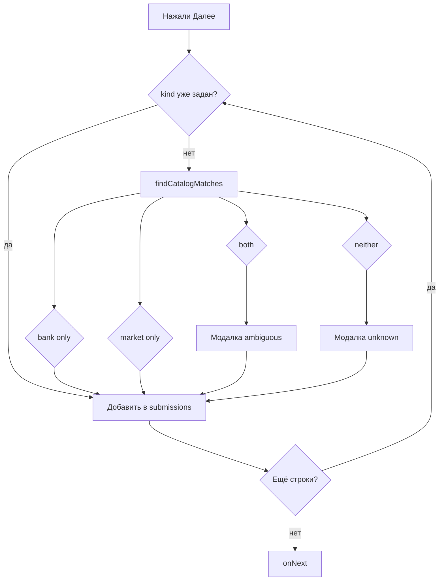

# Unified Provider Autocomplete — Design Spec

**Date:** 2026-06-15  
**Status:** Approved (brainstorming)  
**Scope:** Экран выбора источника кэшбека — автодополнение и классификация по банкам и супермаркетам в одном потоке

## Goal

На экране `bank-select-screen` пользователь может загрузить скриншоты из приложения **банка или супермаркета** (в том числе несколько разных источников за один проход). Поле ввода должно:

1. Подбирать названия из **объединённого** каталога (286 банков + 82 супермаркета) в одном списке по релевантности.
2. При выборе из списка сразу фиксировать `kind` (`bank` | `market`) и `providerSlug`.
3. При ручном вводе без выбора из списка — на «Далее» определять тип автоматически или спрашивать пользователя через модалку.

Обработка OCR (`ProcessingScreen`) и матрица результатов уже поддерживают смешанные `submissions` с разным `kind` на строку — менять backend не требуется.

## Decisions

| Decision | Choice |
|----------|--------|
| Выпадающий список | Один общий список по релевантности, без секций и меток |
| Поиск | Расширить `lib/provider-logos.ts` (подход A), не выносить в отдельный модуль |
| `kind` на строку | Хранить per-row; глобальный `kind` с empty-screen больше не влияет на каталог |
| Точное совпадение в обоих каталогах | Модалка: выбор банк или супермаркет (с логотипами из каталога) |
| Нет совпадения ни в одном каталоге | Модалка при «Далее»: «Не нашли в каталоге — это банк или супермаркет?» |
| Неизвестное имя после выбора типа | `providerName` как ввёл пользователь, `providerSlug` отсутствует, логотип — placeholder |
| Персистентность алиасов | Out of scope (stateless MVP); выбор типа только для текущей сессии |
| Копирайт экрана | Единый текст для банков и супермаркетов |

## Current State

- `EmptyScreen` — одна кнопка «Выбрать скриншоты», всегда передаёт `kind: "bank"`.
- `BankSelectScreen` — `ProviderNameInput` ищет только в каталоге по глобальному `kind`.
- `handleNext` проставляет один `kind` на все строки из пропа.
- `ProcessingScreen` — уже маршрутизирует по `submission.kind`.
- Пересечений канонических имён в текущих JSON-каталогах нет (0 коллизий); модалка неоднозначности — защита на будущее и для алиасов.

## Data Layer (`lib/provider-logos.ts`)

### Типы

```ts
export interface ProviderSuggestion {
  slug: string
  name: string
  logo: string
  kind: Kind  // NEW
}

export interface CatalogMatchResult {
  bank: ProviderSuggestion | null
  market: ProviderSuggestion | null
}
```

### Новые функции

**`searchAllProviderSuggestions(query, limit?)`**

- Ищет в `bankCatalog` и `marketCatalog` параллельно (тот же scoring, что в `searchProviderSuggestions`).
- Каждый результат помечается `kind: "bank" | "market"`.
- Объединяет, сортирует по score → длине имени → `localeCompare("ru")`.
- Ключ уникальности в Map: `` `${kind}:${slug}` ``.

**`findCatalogMatches(name): CatalogMatchResult`**

- Exact match only (как `findCatalogMatch`): алиас → каноническое имя → slug.
- Возвращает не более одного hit на каталог.
- Не выбирает «победителя» при коллизии — это делает UI.

Существующие `searchProviderSuggestions` / `findCatalogMatch` **сохраняются** для `results-overlays` и других мест с одним каталогом.

## UI Components

### `ProviderNameInput`

- Убрать проп `kind` для поиска (или игнорировать при autocomplete).
- Вызывать `searchAllProviderSuggestions(value)`.
- Сигнатура `onChange`: `(name: string, slug: string | null, kind: Kind | null)`.
- При ручном наборе: `slug = null`, `kind = null` (как сейчас сброс slug).
- При выборе из списка: передать `slug` и `kind` из `ProviderSuggestion`.

### `BankSelectScreen`

**State на строку:**

```ts
{ name: string; catalogSlug: string | null; kind: Kind | null }
```

**Единый COPY** (убрать ветку `COPY.bank` / `COPY.market`):

| Элемент | Текст |
|---------|-------|
| Заголовок | Выберите или введите источник кэшбека |
| Подзаголовок | Укажите, из какого приложения сделан скриншот — банка или супермаркета |
| Placeholder | Например, Сбер или Пятёрочка |
| Кнопка добавления | Ещё кэшбек |

**`handleNext` — очередь разрешения**

Перед `onNext` пройти по всем заполненным строкам (имя + скриншот). Строки с уже заданным `kind` (выбор из autocomplete) пропускаются.

Для остальных вызвать `findCatalogMatches(trimmed)`:

| Результат | Действие |
|-----------|----------|
| Только `bank` | `kind: "bank"`, `providerSlug` из банка |
| Только `market` | `kind: "market"`, `providerSlug` из супермаркета |
| Оба | Модалка **ambiguous** (см. ниже) |
| Ни одного | Модалка **unknown** (см. ниже) |

Несколько строк требуют уточнения → модалки **последовательно** (по индексу). Отмена модалки → остаёмся на экране, введённые данные сохраняются.

Итоговый `SourceSubmission`:

```ts
{
  providerName: trimmed,
  screenshotSrc,
  kind,                              // обязателен после разрешения
  providerSlug: slug ?? undefined,
}
```

### `ProviderKindPickerDialog` (новый компонент)

Общий диалог с двумя режимами:

#### Режим `ambiguous`

- **Когда:** exact match в bank и market каталогах для одного ввода.
- **Заголовок:** Уточните источник
- **Текст:** «{введённое имя}» найден и среди банков, и среди супермаркетов
- **Кнопки:** две карточки с логотипом и каноническим именем из каждого каталога.
- **Результат:** выбранный `kind` + `slug` соответствующей записи.

#### Режим `unknown`

- **Когда:** нет exact match ни в одном каталоге.
- **Заголовок:** Уточните тип источника
- **Текст:** «{введённое имя}» не найден в каталоге. Это банк или супермаркет?
- **Кнопки:** «Банк» / «Супермаркет» (без логотипа каталога или с нейтральной иконкой).
- **Результат:** выбранный `kind`, `providerSlug` не задаётся.

Обе кнопки «Отмена» / tap outside → закрыть без перехода на следующий экран.

Размещение: `components/provider-kind-picker-dialog.tsx` (рядом с `provider-name-input.tsx`).

## Downstream (без изменений логики)

- **`ProcessingScreen`** — без изменений; использует `submission.kind` per row.
- **`lib/matrix.ts`** — `resolveProviderLogo(name, kind)` с placeholder для неизвестных.
- **`ResultsScreen`** — опциональный polish: дефолтная вкладка = первая с данными (`bank` приоритетнее, иначе `market`).

Проп `kind` на `BankSelectScreen` / `GalleryScreen` можно оставить для обратной совместимости, но не использовать для каталога и сабмитов.

## Resolution Flow (diagram)



## Verification (manual)

1. Ввод «Сбер» → подсказки банков; выбор → `kind: bank`, корректный slug.
2. Ввод «Магнит» → подсказки; выбор → `kind: market`.
3. Ввод «ма» → общий список (банки + супермаркеты) по релевантности.
4. Две строки: Сбер + Пятёрочка → после OCR две колонки в соответствующих вкладках матрицы.
5. Ввод несуществующего имени «Новый Банк 3000» без выбора из списка → модалка unknown → выбор «Банк» → processing с placeholder-логотипом.
6. (Dev) временный общий алиас в обоих каталогах → модалка ambiguous.
7. `npm run build` проходит.

## Out of Scope

- Сохранение пользовательских алиасов между сессиями (localStorage / backend).
- Добавление новых записей в `bank-catalog.json` / `market-retailers.json` из UI.
- Fuzzy / Levenshtein matching для неизвестных имён.
- Отображение логотипа провайдера на экране bank-select (только в autocomplete dropdown).
- Изменение empty-screen (уже единая кнопка загрузки).

## Files to Touch (implementation hint)

| File | Change |
|------|--------|
| `lib/provider-logos.ts` | `kind` в suggestion, `searchAllProviderSuggestions`, `findCatalogMatches` |
| `components/provider-name-input.tsx` | unified search, расширенный `onChange` |
| `components/provider-kind-picker-dialog.tsx` | NEW |
| `components/screens/bank-select-screen.tsx` | per-row kind, resolution queue, unified COPY |
| `components/screens/results-screen.tsx` | optional default tab polish |
