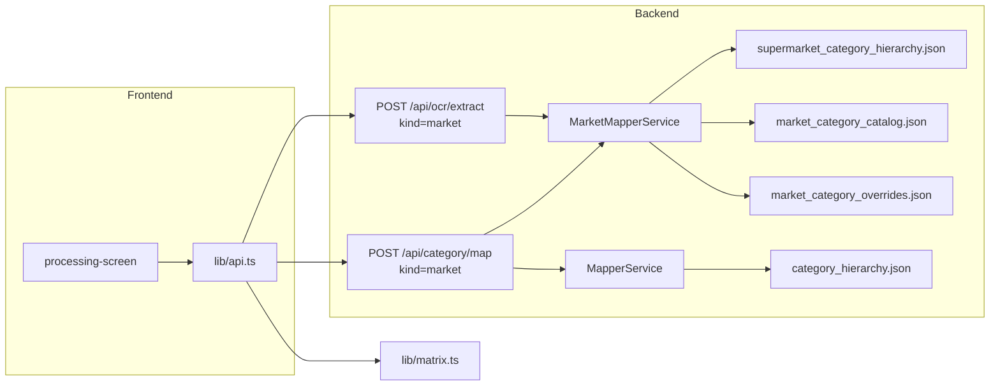

# Supermarket Category Mapping — Design Spec

**Date:** 2026-06-18  
**Status:** Approved  
**Scope:** Маппинг OCR-категорий со скриншотов супермаркетов в единую товарную таксономию (29 L1 + 265 L2) по тому же принципу, что банковский `MapperService`. **Без изменений UI layout** — меняется только backend + data + wiring на фронте.

## Контекст

### Проблема

Супермаркеты сейчас **обходят backend-маппинг**. В `lib/api.ts` функция `mapMarketItemsFromOcr` подставляет `raw_category` как `unified_category` с `confidence: 1`. Матрица супермаркетов не сравнима между сетями: «Кисломолочка» (Магнит) и «Молоко и сливки» (Лента) остаются разными строками.

Банковский пайплайн уже решает аналогичную задачу:

```
OCR → MapperService → unified taxonomy (category_hierarchy.json)
      ↑ bank_category_catalog.json (per-bank lookup)
      ↑ embeddings + LLM fallback
```

### Источник unified-таксономии

Файл: `/Users/kseniya_agrova/obsidian/VIBECODING_Чуйков/supermarket_catalog_tree.json`

| Метрика | Значение |
|---------|----------|
| L1 (разделы) | 29 |
| L2 (субкатегории) | 265 |
| Формат | Вложенное дерево (`categories[].subcategories[]`) |

Копируется в репозиторий: `backend/data/supermarket_catalog_tree.json`.

### Решения, принятые на brainstorming

| Вопрос | Решение |
|--------|---------|
| Уровень строк матрицы | **Гибрид (C):** макро → L1, детальная → L2 (как у банков) |
| Per-market catalog | **Архитектура сразу (C):** lookup по сети, на старте — seed из парсинга L1/L2 |
| API | **Вариант B:** `kind` в существующих endpoints, раздельные сервисы внутри |
| Реализация mapper | **Подход 1:** параллельный `MarketMapperService`, без рефакторинга банков |

## Решение

### Архитектура



Один контракт API, два mapper'а. Одна shared-модель `SentenceTransformer` в `lifespan`.

### API changes

```python
class OcrExtractRequest(BaseModel):
    image_base64: str
    mime_type: Literal["image/jpeg", "image/png", "image/jpg"]
    kind: Literal["bank", "market"] = "bank"

class CategoryMapRequest(BaseModel):
    items: list[CategoryMapRequestItem]
    source_name: str | None = None
    kind: Literal["bank", "market"] = "bank"
    source_slug: str | None = None  # pyaterochka | magnit | lenta
```

Роутеры:

- `kind == "bank"` → `MapperService` (без изменений логики)
- `kind == "market"` → `MarketMapperService`

`/health` расширить: `bank_mapper_loaded`, `market_mapper_loaded`.

Frontend: `SourceSubmission` уже содержит `kind` и `providerSlug` — пробросить в API. Удалить `mapMarketItemsFromOcr`. Включить `isUnreliableMapping` для market.

### OCR: два промпта

| | `OCR_PROMPT_BANK` | `OCR_PROMPT_MARKET` |
|---|---|---|
| Содержание | Текущий промпт (исключения экосистемы банков) | Только товарные категории кэшбэка |
| Исключения | «Альфа Тревел», «Т-Город», «СберТревел»… | Нет банковских правил |
| Супермаркеты | Упоминание в общем промпте | Каждая строка списка — отдельная категория |
| Формат ответа | `[{"raw_category", "rate"}]` | тот же |

`extract_cashback_items(image, mime, kind)` выбирает промпт по `kind`.

### MarketMapperService — cascade matching

Для каждой OCR-строки:

```
1. catalog lookup     → market_category_catalog.json[market_slug][normalized_raw]
2. override           → market_category_overrides.json
3. parent synonym     → market_parent_synonyms.json (raw ≈ L1, is_macro=true)
4. leaf exact         → точное совпадение с L2
5. parent exact       → точное совпадение с L1
6. parent embedding   → L1, threshold ≥ 0.55
7. leaf embedding     → L2 внутри L1, threshold ≥ 0.60
8. LLM parent         → `CategoryClassifierService` (kind=market), `CATEGORY_LLM_FALLBACK`
9. fallback           → L2 «Прочее» / L1 «Прочее» (добавить пару в hierarchy)
```

**Гибрид L1/L2:**

- Шаги 3, 5, 6, 8 → `is_macro_category=true`, строка матрицы = L1
- Шаги 1, 2, 4, 7 → `is_macro_category=false`, строка = L2 (`unified_parent` для группировки)

Пороги: `CATEGORY_PARENT_THRESHOLD=0.55`, `CATEGORY_LEAF_THRESHOLD=0.60` (те же env, что у банков).

`is_bank_offer` для market всегда `false`.

Переиспользуются: `category_embedding.py` (`encode_texts`, `best_match`, `best_match_among`).

### Per-market catalog

Формат зеркалит `bank_category_catalog.json`:

```json
{
  "magnit": {
    "кисломолочка": {
      "market_category": "Кисломолочка",
      "unified_subcategory": "Кефир, ряженка, простокваша",
      "unified_parent": "Молоко, сыр, яйца",
      "is_macro": false
    }
  },
  "pyaterochka": {},
  "lenta": {}
}
```

Lookup: `resolve_market_slug(source_name, source_slug)` через `market_aliases.json`. Consensus-логика между сетями — как у банков (`_build_catalog_indexes`).

#### Seed catalog (data-prep)

**Источник 1 — edadeal.ru (primary, все ритейлеры)**

Список магазинов: `sync_logos/rslp_pack/retailers.json` (72 slug, уже использовался для логотипов).

| Параметр | Значение |
|----------|----------|
| URL | `https://edadeal.ru/moskva/retailers/{slug}` |
| Engine | **Selenium headless Chrome** (JS-rendered; plain HTTP не работает) |
| L1 | `.b-dsk-srch-cats-tree__node_level_0` (кроме «Все») |
| L2 | `.b-dsk-srch-cats-tree__node_level_1` под текущим L1 |
| Модалка 18+ | клик «Мне есть 18» / «Да. Мне есть 18» |
| Скрипт | `scripts/scrape_edadeal_categories.py` |

Slug → catalog key (`backend/data/edadeal_slug_aliases.json`):

| edadeal slug | catalog key |
|--------------|-------------|
| `5ka` | `pyaterochka` |
| `magnit-univer`, `magnit-cosmo`, `mgnl` | `magnit` |
| `lenta-super`, `lenta-giper` | `lenta` |
| остальные | slug as-is (региональные сети) |

**Выходные файлы:**

```json
// backend/data/edadeal_categories_raw.json — по edadeal slug
{
  "magnit-univer": {
    "edadeal_slug": "magnit-univer",
    "catalog_key": "magnit",
    "retailer_name": "magnit-univer",
    "url": "https://edadeal.ru/moskva/retailers/magnit-univer",
    "scraped_at": "2026-06-18T12:00:00Z",
    "l1": ["Продукты", "Для дома", ...],
    "pairs": [{"l1": "Продукты", "l2": "Молочные продукты"}, ...]
  }
}

// backend/data/parsed_market_taxonomies.json — merged по catalog_key для auto_map
{
  "magnit": [{"l1": "Продукты", "l2": "Молочные продукты"}, ...],
  "pyaterochka": [...],
  "lenta": [...],
  "dixy": [...]
}
```

Скрипт поддерживает `--resume` (пропуск уже спарсенных slug), `--limit N`, `--sleep 1.5`.

**Источник 2 — скриншоты кэшбэка (supplement, ongoing)**

Названия с экранов приложений банков (OCR), где формулировки ≠ edadeal:

- «Кисломолочка» (Магнит cashback) vs «Молочные продукты» (edadeal)
- «Молоко и сливки» (Лента cashback) vs edadeal L2

Добавляются вручную или через post-OCR логи в `market_category_catalog.json` после auto-map.

**Pipeline после парсинга:**

1. `python scripts/scrape_edadeal_categories.py` — ~72 магазина, ~1.5 s sleep
2. `python scripts/auto_map_market_catalog.py` — L2 → unified via embeddings
3. Ручной ревью `_auto_map_score < 0.7`
4. Дополнение cashback-названиями (источник 2)
5. `python scripts/verify_market_catalog.py`

### Data files

| Файл | Назначение | Источник |
|------|------------|----------|
| `supermarket_catalog_tree.json` | Исходное дерево | Копия из obsidian |
| `supermarket_category_hierarchy.json` | L1/L2 lists + parent map | Генерация из tree |
| `market_parent_enriched.json` | Embedding-тексты L1 | Генерация (название + дочерние L2) |
| `market_category_catalog.json` | Per-market raw → unified | Парсинг + auto-map + ревью |
| `market_aliases.json` | «Пятёрочка» → `pyaterochka` | Ручной / из `cashback-data.ts` |
| `market_category_overrides.json` | Глобальные синонимы raw → L2 | Пустой на старт |
| `market_parent_synonyms.json` | raw ≈ L1 | Пустой на старт |
| `edadeal_categories_raw.json` | Сырые L1/L2 по edadeal slug | Парсинг edadeal |
| `edadeal_slug_aliases.json` | edadeal slug → catalog key | Ручной + из logos |
| `parsed_market_taxonomies.json` | L1/L2 merged по catalog key | Генерация из raw |
| `market_cashback_consensus.json` | Cashback-названия → unified (все сети) | Ручной consensus |

Скрипты:

- `scripts/generate_supermarket_hierarchy.py`
- `scripts/scrape_edadeal_categories.py`
- `scripts/auto_map_market_catalog.py`
- `scripts/verify_market_catalog.py` (аналог `verify_bank_catalog.py`)

### Frontend changes

`lib/api.ts`:

```typescript
// Удалить mapMarketItemsFromOcr
// extractOcr(image, mime, kind)
// mapCategories(items, sourceName, { kind, sourceSlug })
// isUnreliableMapping — для bank и market
```

`results-screen`, `matrix.ts` — без изменений layout; уже поддерживают `isMacro`, `parent`, `kind`.

### Error handling

- Market: включить `isUnreliableMapping` (сейчас только bank)
- Low-confidence warnings на results-screen — для обоих kind
- Fallback «Прочее» → low-confidence warning
- Банковый flow: регрессий нет (`kind` default `"bank"`)

## Scope

### MVP (этот спринт)

**Backend:** hierarchy generation, `MarketMapperService`, market slug resolver, `kind` в schemas/routers/OCR, shared embeddings в lifespan.

**Frontend:** wiring `kind`/`sourceSlug`, удаление bypass-маппинга.

**Data-prep:** парсинг L1/L2 edadeal (все 72 ритейлера), auto-map, ревью, seed catalog + supplement с cashback-экранов.

**Verify:** `verify_market_catalog.py`, e2e на dev (1 скриншот на сеть).

### Не MVP

- LLM fallback с market-specific промптом (можно включить через `CATEGORY_LLM_FALLBACK`)
- Автодополнение catalog из production-логов (`match_source=fallback`)
- Дополнительные сети (Ашан, Перекрёсток)
- Расширение unified-каталога по результатам парсинга

### Порядок работ

```
Phase 1 — Data foundation
  hierarchy JSON, aliases, пустые overrides/synonyms

Phase 2 — MarketMapperService + router dispatch
  verify script

Phase 3 — OCR split + frontend wiring
  e2e на dev

Phase 4 — Seed catalog (edadeal парсинг всех ритейлеров + auto-map + ревью)
  supplement cashback-названиями, повторный e2e, замер confidence
```

### Критерии успеха

- Скриншот Магнита: «Кисломолочка 10%» → unified L2 «Кефир, ряженка, простокваша» (или L1 при макро)
- Скриншот Ленты: «Молоко и сливки 5%» → сопоставимая unified-строка с Магнитом
- Два супермаркета в одной матрице — сравнимые строки, не raw OCR-названия
- Банковый flow без регрессий

### Роли kind

| kind | OCR промпт | Mapper | Taxonomy |
|------|------------|--------|----------|
| `bank` | Bank (исключения экосистемы) | `MapperService` | `category_hierarchy.json` (27+108) |
| `market` | Market (товарные категории) | `MarketMapperService` | `supermarket_category_hierarchy.json` (29+265) |

## Файлы

### Новые

- `backend/services/market_mapper_service.py`
- `backend/services/market_slug_resolver.py`
- `backend/data/supermarket_catalog_tree.json`
- `backend/data/supermarket_category_hierarchy.json`
- `backend/data/market_parent_enriched.json`
- `backend/data/market_category_catalog.json`
- `backend/data/market_aliases.json`
- `backend/data/market_category_overrides.json`
- `backend/data/market_parent_synonyms.json`
- `scripts/generate_supermarket_hierarchy.py`
- `scripts/auto_map_market_catalog.py`
- `scripts/verify_market_catalog.py`

### Изменённые

- `backend/schemas.py`
- `backend/main.py`
- `backend/routers/category.py`
- `backend/routers/ocr.py`
- `backend/services/ocr_service.py`
- `lib/api.ts`
