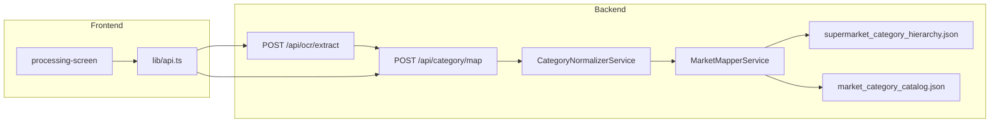

# Category Normalization — Design Spec

**Date:** 2026-06-19  
**Status:** Approved  
**Scope:** Промежуточный шаг **нормализации `raw_category`** между OCR и `MarketMapperService` для супермаркетов. Закрывает опечатки OCR, перестановку слов и синонимы/формы слов **до** catalog lookup. Без изменений UI layout.

## Контекст

### Проблема

Текущий пайплайн:

```
OCR → normalize(lowercase + пробелы) → MarketMapperService catalog lookup (exact key) → …
```

Catalog lookup и consensus работают только при **точном совпадении ключа**. Реальные OCR-строки часто отличаются:

| Тип расхождения | Пример | Сейчас |
|-----------------|--------|--------|
| Мусор OCR | `5% Макароны` | catalog miss → coarse / LLM |
| Опечатка | `Макроны` | parent embedding → **Прочее** |
| Порядок слов | `купаты и колбаски` vs `колбасы и купаты` | catalog miss → **Прочее** |
| Синоним/форма | `колбаски` vs `колбасы` | catalog miss |

Consensus уже содержит `колбасы и купаты`, но OCR даёт `Купаты и Колбаски` — маппер до consensus не доходит.

Отдельные точечные правки (aliases в consensus, coarse_cashback) не масштабируются: каждый новый скриншот — новый ручной ключ.

### Связь с существующим дизайном

[2026-06-18-supermarket-category-mapping-design.md](./2026-06-18-supermarket-category-mapping-design.md) описывает маппинг raw → unified taxonomy. Нормализатор **не заменяет** маппер — он приводит `raw_category` к **каноническому cashback-ключу**, который маппер уже умеет искать в catalog/consensus.

```
OCR → CategoryNormalizer → MarketMapperService → матрица
         ↑ aliases + token-index + fuzzy + LLM
```

## Решения, принятые на brainstorming

| Вопрос | Решение |
|--------|---------|
| Какие ошибки закрываем | **Все вместе (D):** опечатки, порядок слов, синонимы |
| Где в пайплайне | **Перед маппером** — единый шаг на backend |
| Подход к реализации | **Гибрид (B):** правила → fuzzy → LLM fallback |
| Архитектура модуля | **Отдельный `CategoryNormalizerService`** + token-index при load |

## Решение

### Архитектура



- Нормализатор вызывается **только для `kind=market`** внутри `POST /api/category/map` (или shared helper, вызываемый роутером).
- Банковский `MapperService` **не меняется** в MVP (опционально: шаг 1 Sanitize для `%` — позже).

### Каскад нормализации

Для каждой OCR-строки, в порядке:

```
1. sanitize        → снять %, пунктуацию, лишние пробелы
2. alias_exact     → market_category_aliases.json
3. token_set       → lookup по индексу «отсортированных токенов» (игнор «и»)
4. fuzzy           → rapidfuzz vs ключи catalog consensus (порог ≥ 0.88)
5. llm_canonical   → Mistral, выбор из списка cashback-ключей (env flag)
6. passthrough     → вернуть sanitize-результат без изменений
```

| Шаг | `normalize_source` | Условие остановки |
|-----|-------------------|-------------------|
| sanitize | `sanitize` | Только если изменилась строка; иначе продолжить |
| alias_exact | `alias` | Точное совпадение в aliases |
| token_set | `token_set` | Совпадение token-set ключа с индексом |
| fuzzy | `fuzzy` | `ratio ≥ CATEGORY_NORMALIZE_FUZZY_THRESHOLD` (default 0.88) |
| llm_canonical | `llm` | `CATEGORY_NORMALIZE_LLM_FALLBACK=true` и ответ в whitelist |
| passthrough | `passthrough` | Ничего не подошло |

**Правило:** нормализатор **никогда не выдумывает** новых слов — только приводит к существующему ключу из whitelist (consensus + catalog keys + aliases). Если шаги 2–5 не сработали, в маппер уходит sanitize-строка как есть.

### Sanitize (шаг 1)

- Убрать ведущий процент: `^\d+([.,]\d+)?\s*%?\s*` и вариант `%` в начале.
- Trim, collapse whitespace.
- Сохранить регистр слов как после sanitize (маппер сам lowercases для lookup).
- Не удалять содержательные слова.

Примеры:

| Вход | Выход |
|------|-------|
| `5% Макароны` | `Макароны` |
| `  купаты и колбаски ` | `купаты и колбаски` |

### Token-set index (шаг 3)

При `load()` построить индекс из:

- всех ключей `market_cashback_consensus.json`
- всех ключей `market_category_catalog.json` с `_consensus: true`

Для каждого ключа вычислить **token-set signature**:

```python
def token_set_key(name: str) -> str:
    tokens = [t for t in normalize(name).split() if t != "и"]
    return " ".join(sorted(tokens))
```

Lookup: `token_set_key(input)` → canonical catalog key.

Примеры:

| Вход | Token-set | Канонический ключ |
|------|-----------|-------------------|
| `сидр и пиво` | `пиво сидр` | `пиво и сидр` |
| `пиво и сидр` | `пиво сидр` | `пиво и сидр` |
| `купаты и колбаски` | `колбаски купаты` | `колбасы и купаты` * |

\* Для синонимов вроде `колбаски`/`колбасы` token-set alone недостаточен — нужен alias (шаг 2).

### Aliases (шаг 2)

Файл: `backend/data/market_category_aliases.json`

```json
{
  "макроны": "макароны",
  "купаты и колбаски": "колбасы и купаты",
  "купаты и колбасы": "колбасы и купаты",
  "колбаски и купаты": "колбасы и купаты"
}
```

Формат: `normalized_misspelling → normalized_canonical_key`.

Источники пополнения:

1. Ручные записи при ревью скриншотов.
2. Скрипт `scripts/build_category_alias_index.py` — token-permutations для 2–3-словных consensus-ключей (генерирует только перестановки, не синонимы).

### Fuzzy (шаг 4)

- Библиотека: `rapidfuzz` (добавить в `backend/requirements.txt`).
- Сравнение: `fuzz.ratio(normalized_input, candidate_key)` по whitelist ключей.
- Порог: `CATEGORY_NORMALIZE_FUZZY_THRESHOLD=0.88` (env).
- При нескольких кандидатах выше порога — брать **максимальный score**; при равенстве — **не угадывать** (passthrough).

### LLM fallback (шаг 5)

Только если 2–4 не дали результата. Переиспользовать `MISTRAL_API_KEY` и паттерн `CategoryClassifierService`.

Промпт: «Приведи название категории кэшбэка к **одному** ключу из списка (точное совпадение). Если ни один не подходит — верни `null`.»

Whitelist = ключи `market_cashback_consensus.json` (не 265 L2).

Env: `CATEGORY_NORMALIZE_LLM_FALLBACK` (default `false` на старте, `true` в dev).

### Контракт API

`MappedItem` расширить (optional, backward-compatible):

```python
normalized_raw_category: str | None = None  # после нормализатора
normalize_source: Literal[
    "sanitize", "alias", "token_set", "fuzzy", "llm", "passthrough"
] | None = None
```

- `raw_category` — **всегда** оригинал с OCR (для UI / аудита).
- `MarketMapperService.map_items()` получает уже **нормализованную** строку для lookup; оригинал сохраняется в `raw_category` item.

Роутер `category.py`:

```python
if kind == "market":
    items = normalize_market_items(items)  # новый helper
return market_mapper.map_items(items, ...)
```

### Интеграция с display-логикой

Нормализатор **не меняет** правило display/canonical из [market mapper](./2026-06-18-supermarket-category-mapping-design.md):

- UI заголовок = слово со скрина (`raw_category` / `market_category`).
- Сравнение между сетями = `unified_subcategory` (canonical).

Нормализатор только повышает шанс, что маппер найдёт правильный catalog/consensus entry.

### Data files

| Файл | Назначение |
|------|------------|
| `market_category_aliases.json` | Явные опечатки и синонимы → canonical key |
| `market_cashback_consensus.json` | Источник whitelist + token-index (без изменений формата) |
| `market_category_catalog.json` | Дополнительные ключи для fuzzy/index |

### Скрипты

| Скрипт | Назначение |
|--------|------------|
| `scripts/build_category_alias_index.py` | Генерация token-permutation aliases из consensus |
| `scripts/verify_category_normalizer.py` | Unit-like verify без SentenceTransformer |

### Error handling

- Нормализатор **не бросает** на неизвестной строке — passthrough.
- Fuzzy ниже порога — не применять (избегаем «колбаска» → «колбасные изделия»).
- LLM ответ вне whitelist — passthrough.
- Логировать: `raw_category`, `normalized_raw_category`, `normalize_source` (stdout / structured).

### Scope

#### MVP

- `CategoryNormalizerService` + `market_category_aliases.json` (seed: макроны, купаты/колбаски, пиво/сидр).
- Token-set index из consensus.
- Fuzzy с rapidfuzz.
- Интеграция в `POST /api/category/map` для `kind=market`.
- `verify_category_normalizer.py` + расширение `verify_market_catalog.py` e2e кейсами.
- Поля `normalized_raw_category`, `normalize_source` в schemas (optional).

#### Не MVP

- LLM fallback (можно включить флагом после стабилизации правил).
- Sanitize для bank OCR.
- Автогенерация aliases из production-логов.
- Phonetic / stemmer для русского.

### Критерии успеха

| Вход (OCR) | После normalize | После mapper |
|------------|-----------------|--------------|
| `5% Макароны` | `макароны` | display `Макароны`, canonical `Бакалея` |
| `Макроны` | `макароны` | то же |
| `Купаты и Колбаски` | `колбасы и купаты` | parent `Колбасные изделия`, display `Купаты и Колбаски` * |
| `сидр и пиво` | `пиво и сидр` | macro `Алкогольные напитки` |

\* Display остаётся OCR-текст; normalize влияет только на lookup.

### Порядок работ

```
Phase 1 — CategoryNormalizerService + aliases seed + token-index
Phase 2 — Router integration + schema fields
Phase 3 — fuzzy + verify script
Phase 4 — LLM fallback (optional flag) + e2e на dev
```

### Файлы

#### Новые

- `backend/services/category_normalizer_service.py`
- `backend/data/market_category_aliases.json`
- `scripts/build_category_alias_index.py`
- `scripts/verify_category_normalizer.py`

#### Изменённые

- `backend/routers/category.py`
- `backend/schemas.py`
- `backend/requirements.txt` (rapidfuzz)
- `scripts/verify_market_catalog.py` (e2e кейсы)
- `lib/types.ts` (optional fields)

#### Без изменений

- `components/` layout
- `MarketMapperService` cascade (кроме входной строки)
- Bank mapper
