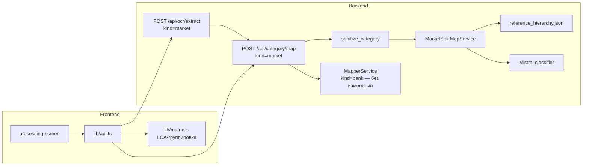

# Нормализация, разбиение и группировка категорий кэшбэка магазинов — Design Spec

**Дата:** 2026-06-19
**Статус:** На ревью
**Scope:** Маппинг market-категорий с экранов магазинов в эталонную иерархию продуктов: разбиение составных значений, смысловое сопоставление каждой части в узел дерева через LLM и сравнение магазинов на динамическом общем предке (LCA). Банковский `MapperService` **не меняется**.

**Builds on / supersedes (market path):** [2026-06-20-reference-hierarchy-mapping-design.md](./2026-06-20-reference-hierarchy-mapping-design.md) — берёт идею эталонной иерархии и LLM-маппинга, но заменяет «один узел + depth» на «1:N split + path + LCA», а также пересобирает сам справочник в дерево переменной глубины.

## Контекст

### Проблема

На скриншотах магазинов кэшбэк указывается в произвольной форме:

1. **Конкретный товар** с детализацией: «Пиво светлое», «Шампанское брют».
2. **Несколько товаров** через запятую/союз: «Пиво и сидр», «Пиво, молоко, хлеб».
3. **Категория в разговорной форме**: «Кисломолочка», «Молочка», «Алкоголь».

Чтобы корректно сравнивать магазины по размеру кэшбэка, нужно:

1. **Разделять** составные значения на отдельные товары/категории.
2. **Сопоставлять** каждое значение с ближайшим узлом эталонного справочника.
3. **Находить общий уровень сравнения** — нижайшего общего предка (LCA) сопоставленных узлов между магазинами.

### Источник истины

Документ: `/Users/kseniya_agrova/obsidian/VIBECODING_Чуйков/Эталонная иерархия категорий продуктов питания.md` — 12 отделов, дерево из GS1 GPC / ОКПД 2 / зонирования российских супермаркетов, глубина **до 4 уровней** (Отдел → Категория → Подкатегория → Товар).

### Решения, принятые на brainstorming

| Вопрос | Решение |
|--------|---------|
| Объём | Полный пересмотр market-алгоритма (вариант «fresh»), существующее можно заменить |
| Уровень сравнения | **Динамический LCA** + отдельные строки-товары |
| Подход к маппингу | **Вариант A: LLM-first** один проход (split+map), точность важнее, LLM допустим |
| Разбиение | LLM сам решает и возвращает **список узлов** на строку |
| Справочник | Чистый JSON: `name` без скобок + `examples` из скобок |
| Структура справочника | Дерево **переменной глубины** (реальная вложенность `.md`), не насильно 3 уровня |
| Критерий разбиения | Разбивать, если фраза = разные узлы; не разбивать, если фраза = один узел (вкл. названия отделов) |
| Ставка на строке-якоре | **Диапазон** min–max |
| Модель LLM | Выбрать эмпирически (small/medium/large), провизорно `mistral-large-latest` |
| Банки | Без изменений |

## Решение

### Архитектура



### Пайплайн (market)

```
OCR raw_category (+rate)
  → sanitize_category (срезает ставку/шум) [существует]
  → MarketSplitMapService.map_items (LLM: строка → список узлов)
  → MappedItem[] (1:N — частей может быть больше, чем входных строк)
  → lib/matrix.ts (кластер по отделу → спуск по покрытию → якорь LCA + строки-товары)
```

---

## Раздел 1 — Эталонный справочник как чистое дерево переменной глубины

Пересобрать `backend/data/reference_hierarchy.json` из `.md`, сохраняя **реальную** вложенность (2–4 уровня). Узел:

```json
{
  "id": "d09.c06.n01",
  "name": "Пиво и пивные напитки",
  "examples": [],
  "children": [
    { "id": "d09.c06.n01.n01", "name": "Светлое пиво", "examples": [] }
  ]
}
```

**Правила файла:**

- `name` — каноническое название, скобки удалены (для UI).
- `examples` — массив, распарсенный из содержимого скобок. Пример: «Минеральная вода (столовая, лечебно-столовая: Ессентуки, Боржоми)» → `name: "Минеральная вода"`, `examples: ["столовая", "лечебно-столовая", "Ессентуки", "Боржоми"]`. Используются только как подсказки в промпте LLM, в UI не показываются.
- `id` — стабильный ключ, вложенность = реальная глубина. Уровень узла определяется неявно по длине пути.
- Узел не хранит жёсткую метку L1/L2/L3 — дерево обходится для предков/LCA. Корневой узел (отдел) — потолок кластера сравнения.
- Синтетический отдел `d99` «Прочее» как `fallback_node_id`.
- Плоский индекс `nodes_by_id` и `parent_by_id` строятся при `load()`, в JSON не хранятся.

**Чем плох текущий файл:** `examples` везде `null`, имена со скобками, а 4-уровневый `.md` был «расплющен» в сломанное 3-уровневое дерево (в `d09.c06` «Пиво и пивные напитки», «Светлое пиво», «Вино», «Сидр» лежат как сиблинги одного уровня — это ломает LCA). Файл перегенерируется.

**Скрипт сборки** `scripts/build_reference_hierarchy.py`:

- Вход: путь к `.md` (env `REFERENCE_HIERARCHY_MD` или CLI-аргумент).
- Парсит блоки ` ``` ` с деревом (`├──`, `│`, отступы → глубина), делит `name (examples)`.
- Выход: вложенный `reference_hierarchy.json`.
- `--check`: JSON валиден, `id` уникальны, скобки распарсены — для CI.

---

## Раздел 2 — Сервис split+map (LLM, схема 1:N)

`MarketSplitMapService` (заменяет `ReferenceMapperService`). Для каждой OCR-строки возвращает **список** узлов эталона.

### Контракт

Вход: `raw_category` (после sanitize), `rate`, `source_name`.
Выход на строку: `parts: [{ split_text, node_id, confidence }, ...]` (1 или несколько).

```
"Пиво и сидр"     → [{split_text:"Пиво", node_id:"d09.c06.n01"},
                     {split_text:"Сидр", node_id:"d09.c06.n10"}]
"Молоко и сливки" → [{split_text:"Молоко", node_id:"d04.c01.n01"},
                     {split_text:"Сливки", node_id:"d04.c05.n04"}]
"Кисломолочка"    → [{split_text:"Кисломолочка", node_id:"d04.c02"}]
"Мясо и птица"    → [{split_text:"Мясо и птица", node_id:"d02"}]  // отдел, не разбивать
```

### Критерий разбиения (единый)

> **Разбивать, если фраза перечисляет товары/категории, соответствующие РАЗНЫМ узлам эталона. Не разбивать, если вся фраза соответствует ОДНОМУ узлу** (включая названия отделов: «Мясо и птица», «Овощи и фрукты» → узел-отдел, макрокатегория).

Решение принимает LLM по closed-list. Неоднозначное «и» (разделитель vs часть названия) разрешается тем же критерием: есть ли в эталоне узел, целиком покрывающий фразу.

### Логика LLM

Один батч-вызов Mistral на скриншот. Промпт включает:

- закрытый список узлов в виде `node_id | полный путь` + `examples` узла как подсказки;
- инструкцию: «для каждой строки верни массив `parts`; раздели только если строка перечисляет разные товары/категории; выбери самый конкретный узел, оправданный формулировкой; не углубляйся дальше написанного»;
- правила для неоднозначного «и» и названий отделов;
- few-shot: Пиво и сидр; Молоко и сливки; Мясо и птица; Кисломолочка; Шампанское; Замороженные продукты.

`depth` от LLM **не требуется** — уровень узла берётся из дерева по `node_id`. На каждую часть LLM возвращает только `node_id` + `confidence`.

### Валидация и fallback (по части)

- `node_id` не существует в дереве → fallback `d99` «Прочее».
- `confidence < MARKET_MAP_CONFIDENCE_MIN` (default 0.5) → fallback.
- Невалидный JSON / таймаут / пустой ответ LLM → строка целиком одной частью с fallback-узлом, флаг в `processingSummary`.
- Пустой OCR → пустой список.

### Кэш

In-memory кэш `(normalized_key, source_name) → parts` (значение — весь список частей). Ключ — нормализованная строка.

### Что удаляется

Логика «один узел + depth + `resolve_display_node`» (подъём по уровню) больше не нужна — LLM сразу выбирает узел нужной детализации.

---

## Раздел 3 — Слой сравнения (LCA + строки-товары)

После маппинга — плоский список частей по всем магазинам: `{ store, node_id, path, rate }`.

### Алгоритм

1. **Группировка по отделу.** Сравнение никогда не поднимается выше отдела (L1). «Пиво» и «Хлеб» (разные отделы) — отдельные группы, общей строки нет.
2. **Внутри отдела — спуск по покрытию.** Для узла поддерева «покрытие» = множество магазинов с товаром в этом поддереве.
   - От отдела вниз: пока **один** дочерний узел покрывает все те же магазины — спускаемся (сравнение конкретнее).
   - Останавливаемся, когда покрытие расходится по нескольким детям → текущий узел = **якорь сравнения** (LCA).
3. **Строка-якорь:** по каждому магазину — его ставка(и) в поддереве.
4. **Строки-товары** под якорем: каждая распознанная часть с именем узла и ставкой магазина.

### Ставка на строке-якоре

Если у магазина в поддереве якоря несколько товаров с разными ставками — показываем **диапазон** min–max (напр. «5–10%»). Точные ставки — на строках-товарах.

### Проверка на примерах

- Магнит «Пиво и сидр» → [Пиво, Сидр] (под c06); Лента «Шампанское» → Игристое (под c06). Отдел Напитки покрыт обоими → спуск в c06 (покрыт обоими) → дальше расхождение → **якорь = Алкогольные напитки**. Строки-товары: Пиво, Сидр, Шампанское.
- Магнит alcohol (c06); Лента «Лимонад» (c03). Отдел Напитки покрыт обоими; c06 — только Магнит, c03 — только Лента → расхождение под отделом → **якорь = Напитки**. Строки-товары: Пиво, Сидр, Лимонад.

### Где считается

Бэкенд возвращает по каждой части полный `reference_path` (предки от отдела до узла). Фронтенд (`lib/matrix.ts`) строит группы и якоря по путям — дерево целиком слать не нужно. Сохраняется текущая архитектура «матрица собирается на фронте».

---

## Раздел 4 — Схемы API и фронтенд

### Бэкенд `MappedItem` (market)

Записей больше, чем входных строк (1:N). Поля на часть:

```python
raw_category: str            # исходная OCR-строка (повторяется для частей одной строки)
split_text: str | None       # текст части («Пиво»)
reference_node_id: str | None
display_label: str | None    # каноническое имя узла
reference_path: list[ReferencePathNode] | None  # [{id, name}, …] от отдела до узла
reference_department: str | None     # имя корневого узла (отдел)
reference_depth: int | None  # опционально, из длины пути
rate: float
confidence: float
match_source: Literal["reference_split_llm", "reference_cache", "reference_fallback", ...]
# unified_category / unified_parent / unified_subcategory — заполняются для обратной совместимости
```

`routers/category.py` (market): sanitize по каждой входной строке → `MarketSplitMapService.map_items(...)` → плоский список частей. Кол-во ответных элементов ≥ входных.

`/health`: `reference_mapper_loaded` (или `market_mapper_loaded`).

### Фронтенд

- `lib/types.ts`: `MatrixRow` получает `referencePath`; добавляем тип строки `kind: "anchor" | "item"`.
- `lib/matrix.ts`: market-ветка переписывается на алгоритм Раздела 3 (кластер по отделу → спуск по покрытию → якорь + строки-товары); ставка якоря — диапазон min–max. Упрощённая `resolveMarketComparisonAnchor` (L3→L2) удаляется.
- `lib/reference-hierarchy-order.ts`: порядок отделов, регенерируется из нового JSON.
- `results-screen.tsx`: layout не меняется (группы уже раскрываемые).

---

## Раздел 5 — Ошибки, env, верификация, миграция

### Ошибки / fallback

| Ситуация | Поведение |
|----------|-----------|
| Нет `MISTRAL_API_KEY` | 503 на `/api/category/map` (market) |
| `MARKET_SPLIT_MAP_LLM_ENABLED=false` | 503 (offline-режима для смыслового маппинга нет) |
| LLM timeout / битый JSON | строка → `d99` «Прочее», `confidence=0`, warning в `processingSummary` |
| Пустой OCR | пустой список |

### Env

| Переменная | Default | Назначение |
|------------|---------|------------|
| `MISTRAL_API_KEY` | — | обязателен для market map |
| `MISTRAL_CLASSIFIER_MODEL` | `mistral-large-latest` (провизорно) | модель split+map |
| `MARKET_SPLIT_MAP_LLM_ENABLED` | `true` | выключить → 503 |
| `MARKET_MAP_BATCH_SIZE` | `30` | размер батча строк |
| `MARKET_MAP_CONFIDENCE_MIN` | `0.5` | порог fallback |
| `REFERENCE_HIERARCHY_MD` | путь к `.md` | для build-скрипта |

### Верификация

| Скрипт | Назначение |
|--------|------------|
| `scripts/build_reference_hierarchy.py --check` | JSON валиден, id уникальны, скобки в `examples` |
| `scripts/verify_split_map_offline.py` | LCA/спуск/диапазон на синтетических путях, без API |
| `scripts/verify_split_map.py` | LLM-кейсы (mock + live); **прогон small/medium/large** для выбора дефолта модели |

**Обязательные кейсы:**

| OCR | Ожидание |
|-----|----------|
| Пиво и сидр | [Пиво, Сидр]; якорь Алкогольные напитки |
| alcohol + Лимонад (между магазинами) | якорь Напитки; строки-товары Пиво, Сидр, Лимонад |
| Молоко и сливки | [Молоко, Сливки]; общий предок — отдел Молочные продукты и яйца |
| Мясо и птица | отдел Мясо и птица (не разбивать) |
| Кисломолочка | Кисломолочные продукты |
| Шампанское | Игристое (под Алкогольные напитки) |
| 5% Макароны | Макаронные изделия после sanitize |
| Замороженные продукты | отдел Замороженные продукты |

### Дефолт модели

Выбирается эмпирически: `verify_split_map.py` прогоняет small/medium/large по обязательным кейсам, дефолт фиксируется по результатам (провизорно `mistral-large-latest`, env-настраиваемо).

### Миграция / удаление

- Заменить `ReferenceMapperService` на `MarketSplitMapService`; убрать `resolve_display_node` и depth-логику.
- Перегенерировать `reference_hierarchy.json` (новый формат) и `lib/reference-hierarchy-order.ts`.
- Сохранить: `sanitize_category` (`category_text_utils.py`), банковский `MapperService`, паттерн Mistral-клиента.
- Старые market-артефакты уже в `backend/data/archive/`.

## Out of scope

- Банковский маппинг и `category_hierarchy.json`.
- Персистентность кэша LLM между сессиями (Redis).
- Автоматический ребилд `.md` → JSON в CI.
- Редизайн layout экрана результатов (меняются только данные и группировка).
