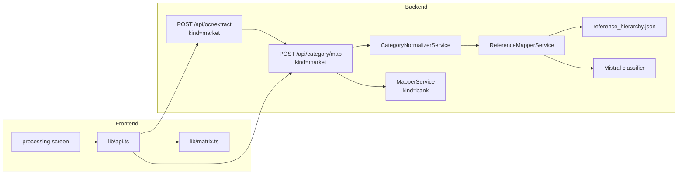

# Reference Hierarchy Mapping — Design Spec

**Date:** 2026-06-20  
**Status:** Approved  
**Scope:** Радикальная замена market-маппинга: эталонная 3-уровневая иерархия продуктов питания как единственный источник унифицированных названий; смысловое сопоставление OCR → узел дерева через LLM. Банковский `MapperService` **не меняется**.

**Supersedes (market path only):** [2026-06-18-supermarket-category-mapping-design.md](./2026-06-18-supermarket-category-mapping-design.md) (Edadeal / catalog / consensus / embeddings).  
**Builds on:** [2026-06-19-category-normalization-design.md](./2026-06-19-category-normalization-design.md) (sanitize + alias до маппера).

## Контекст

### Проблема

Текущий market-пайплайн (catalog lookup, `market_cashback_consensus.json`, parent/leaf embeddings, Edadeal L2) даёт плохой UX:

| Симптом | Пример |
|---------|--------|
| Жаргон не нормализуется | «Кисломолочка» остаётся жаргоном |
| Неверная группировка | «Йогурты и молочные десерты» под «Шоколад, конфеты, сладости» |
| Родители с экрана сети | «Молоко, сыр, яйца» вместо отдела эталона |
| Изобретённые L2 | «Утка и другая птица» вместо «Птица» |

Корневая причина: unified-таксономия собрана из Edadeal и парсинга сетей, а не из осмысленной продуктовой классификации. Правила и fuzzy не масштабируются на жаргон и сетевые группировки.

### Источник истины

Документ: `/Users/kseniya_agrova/obsidian/VIBECODING_Чуйков/Эталонная иерархия категорий продуктов питания.md`

| Уровень | Название | Пример |
|---------|----------|--------|
| L1 | Отдел | Молочные продукты и яйца |
| L2 | Категория | Кисломолочные продукты |
| L3 | Подкатегория | Йогурты |

12 отделов, дерево категорий из GS1 GPC / ОКПД 2 / зонирования российских супермаркетов.

Копия в репозитории: `backend/data/reference_hierarchy.json` (генерируется скриптом из `.md`).

### Решения, принятые на brainstorming

| Вопрос | Решение |
|--------|---------|
| Источник категорий | Эталонная иерархия из `.md`, не Edadeal/consensus |
| Глубина маппинга | **Гибкая (C):** coarse cashback → L1/L2; детальный → L2/L3 |
| Отображение в матрице | **Вариант C:** родитель = отдел эталона; дочерние строки = канонические названия |
| Смысловой маппинг | **LLM-first:** Mistral выбирает `node_id` из закрытого списка эталона |
| Техническая нормализация | `CategoryNormalizerService` (sanitize + alias) **до** LLM, без LLM в normalizer |
| Банки | Без изменений |

## Решение

### Архитектура



**Убираем для market:** `MarketMapperService`, embeddings, `market_category_catalog.json`, `market_cashback_consensus.json`, `supermarket_category_hierarchy.json`, Edadeal-данные, `coarse_cashback`, market LLM parent classifier на старом списке L1.

**Оставляем:** OCR (market prompt), `CategoryNormalizerService`, банковский `MapperService`, shared Mistral client pattern.

### Пайплайн (market)

```
OCR raw_category
  → CategoryNormalizer (sanitize, alias, token-set, fuzzy — без LLM)
  → ReferenceMapperService (LLM batch classify → node_id + depth)
  → MappedItem с reference_* полями
  → lib/matrix.ts (группировка по reference_department)
```

### `reference_hierarchy.json`

```json
{
  "version": "1.0",
  "source": "Эталонная иерархия категорий продуктов питания.md",
  "departments": [
    {
      "id": "d04",
      "name": "Молочные продукты и яйца",
      "categories": [
        {
          "id": "d04.c02",
          "name": "Кисломолочные продукты",
          "subcategories": [
            { "id": "d04.c02.s01", "name": "Йогурты" },
            { "id": "d04.c02.s02", "name": "Кефир и ряженка" }
          ]
        }
      ]
    }
  ],
  "fallback_node_id": "d99.c01"
}
```

**Правила файла:**

- `id` — стабильный ключ (`d{nn}`, `d{nn}.c{nn}`, `d{nn}.c{nn}.s{nn}`).
- `name` — каноническое русское название для UI.
- Плоский индекс `nodes_by_id` строится при `load()` (не хранится в JSON).
- Узел «Прочее» — синтетический L2 под отделом `d99` «Прочее» для fallback.
- Примечания из `.md` (пограничные случаи) — в `backend/data/reference_hierarchy_notes.json` или комментарии в скрипте сборки; в промпт LLM попадают 5–10 ключевых примеров.

**Скрипт:** `scripts/build_reference_hierarchy.py`

- Вход: путь к `.md` (env `REFERENCE_HIERARCHY_MD` или аргумент CLI).
- Парсит блоки ` ``` ` с деревом `├──` / `│`.
- Выход: `backend/data/reference_hierarchy.json`.
- Ручная правка JSON после генерации допустима; скрипт идемпотентен с `--check`.

### ReferenceMapperService

**Ответственность:** для каждой OCR-строки вернуть узел эталона и глубину отображения.

**Загрузка (`load()`):**

- Читает `reference_hierarchy.json`.
- Строит `nodes_by_id`, `flat_paths` (для промпта), `department_order`.

**Маппинг (`map_items(items, source_name, normalized_by_item)`):**

1. Проверить in-memory кэш `(normalize_key, source_name) → result`.
2. Собрать некэшированные в батч (макс. 30 строк / вызов, env `REFERENCE_MAP_BATCH_SIZE`).
3. Вызвать `_classify_batch()` → Mistral JSON.
4. Валидировать каждый `node_id` ∈ `nodes_by_id`.
5. При невалидном `node_id` или `confidence < 0.5` → `fallback_node_id`.
6. Разрешить `depth` (см. ниже).
7. Заполнить `MappedItem`.

**Не использует:** SentenceTransformer, catalog, consensus.

### LLM-промпт (батч)

Модель: `MISTRAL_CLASSIFIER_MODEL` (default `mistral-small-latest`).  
Флаг: `REFERENCE_MAP_LLM_ENABLED` (default `true`).

```
Ты классификатор категорий кэшбэка супермаркетов.
Для каждой строки выбери узел из эталонной иерархии продуктов.
Верни node_id и depth.

Правила глубины (depth):
- 1 = отдел (L1): только если формулировка охватывает весь отдел
  («Замороженные продукты», «Готовая еда»)
- 2 = категория (L2): жаргон и сетевые группы
  («Кисломолочка» → Кисломолочные продукты, «Твёрдые сыры» → Сыры)
- 3 = подкатегория (L3): только если формулировка явно узкая («Молоко», «Йогурты»)
- Не углубляйся дальше, чем позволяет формулировка с экрана

Супермаркет: {source_name}

Строки:
- raw: «Кисломолочка», normalized: «кисломолочка»

Узлы (node_id | полный путь):
d04 | Молочные продукты и яйца
d04.c02 | Молочные продукты и яйца > Кисломолочные продукты
...

Примеры:
- «Кисломолочка» → d04.c02, depth 2
- «Молоко, сыр, яйца» → d04, depth 1
- «Молоко» → d04.c01.s01, depth 3
- «Шоколад, конфеты, сладости» → d11.c01, depth 2

Верни ТОЛЬКО JSON:
{"items":[{"raw":"...","node_id":"d04.c02","depth":2,"confidence":0.95}]}
```

**Оптимизация промпта:** в батч передавать только релевантные отделы, если OCR < 15 строк — весь список L1+L2 (L3 — по запросу или top-k отделов из L1 guess). MVP: полный плоский список L1+L2 (~80–120 узлов); L3 — только если LLM вернул L2 и нужно уточнить (phase 2) или включить L3 для отделов, присутствующих в батче.

**MVP упрощение:** один проход, LLM выбирает из всех L1+L2+L3; при `depth < 3` отображаем узел на указанном уровне (truncate path).

### Гибкая глубина — разрешение `depth`

| `depth` | `display_label` | `reference_department` | Строка в матрице |
|---------|-----------------|------------------------|------------------|
| 1 | имя L1 | то же | ставка на заголовке отдела (coarse) |
| 2 | имя L2 | L1 родителя | дочерняя строка под отделом |
| 3 | имя L3 | L1 родителя | дочерняя строка под отделом |

Алгоритм `_resolve_display_node(node_id, depth)`:

- `depth=1` → узел = L1 (department).
- `depth=2` → узел = L2 (category); если `node_id` указывает на L3, поднять к родителю L2.
- `depth=3` → узел = L3 (subcategory).

Ключ матрицы: `reference_node_id` на resolved depth (не OCR-текст).

### API / схемы

`MappedItem` — добавить поля (market):

```python
reference_node_id: str | None = None
reference_department: str | None = None
reference_category: str | None = None
reference_subcategory: str | None = None
reference_depth: Literal[1, 2, 3] | None = None
display_label: str | None = None  # каноническое имя для UI
match_source: Literal[..., "reference_llm", "reference_cache", "reference_fallback"]
```

Для обратной совместимости фронта (переходный период):

| Новое поле | Заполняет legacy |
|------------|------------------|
| `display_label` | `unified_category` |
| `reference_department` | `unified_parent` |
| `reference_category` или L2 при depth=2 | `unified_subcategory` |
| `reference_depth == 1` | `is_macro_category = true` |

`routers/category.py` для `kind=market`:

```python
normalizer → ReferenceMapperService.map_items(...)
```

`/health`: `reference_mapper_loaded` (или переименовать `market_mapper_loaded`).

### Frontend — матрица (вариант C)

`lib/types.ts` — поля `referenceNodeId`, `referenceDepartment`, `referenceDepth`, `displayLabel`.

`lib/matrix.ts`:

- **Ключ строки:** `ref::{reference_node_id}::{depth}`.
- **Группировка:** `groupMatrixRows` → по `referenceDepartment` (порядок из `department_order` в статическом `reference_hierarchy_order.ts` или с бэкенда).
- **Родитель группы:** название отдела (L1), expandable.
- **Дочерние строки:** `referenceDepth >= 2`, label = `displayLabel` (каноническое).
- **Coarse (`depth=1`):** ставка на строке отдела, без детей; если позже приходит детальная ставка той же сети — дети добавляются, coarse остаётся только если нет перекрытия (не суммировать).
- Убрать логику `canonicalCategory` / OCR display split для market — всегда каноника.

`results-screen.tsx`: без смены layout; группы уже expandable через `expandedParents`.

### CategoryNormalizer

Без изменений логики MVP: sanitize + alias + token-set + fuzzy.  
Алиасы жаргона (`кисломолочка` → не нужен, если LLM понимает) — опционально убрать дубли после стабилизации LLM.

### Верификация

| Скрипт | Назначение |
|--------|------------|
| `scripts/build_reference_hierarchy.py --check` | JSON валиден, id уникальны |
| `scripts/verify_reference_mapper.py` | LLM cases (mock или live с `MISTRAL_API_KEY`) |
| `scripts/verify_reference_mapper_offline.py` | resolve depth / display без API |

**Обязательные кейсы:**

| OCR | Ожидание |
|-----|----------|
| Кисломолочка | L2 Кисломолочные продукты, dept Молочные продукты и яйца |
| Молоко, сыр, яйца | L1 Молочные продукты и яйца, depth 1 |
| Молоко | L3 Молоко, dept Молочные продукты и яйца |
| Твёрдые сыры | L2 Сыры или L3 Твёрдые и полутвёрдые сыры |
| Замороженные продукты | L1 Замороженные продукты, depth 1 |
| Шоколад, конфеты, сладости | L2 под Снеки и кондитерские изделия |
| Йогурты и молочные десерты | L2/L3 под Молочные, не под Снеки |
| 5% Макароны | L2 Макаронные изделия после sanitize |

### Ошибки и fallback

| Ситуация | Поведение |
|----------|-----------|
| `MISTRAL_API_KEY` отсутствует | 503 на `/api/category/map` для market |
| LLM timeout / invalid JSON | `fallback_node_id`, `confidence=0`, warning в `processingSummary` |
| `REFERENCE_MAP_LLM_ENABLED=false` | 503 (нет offline MVP для semantic map) |
| Пустой OCR | пустой список |

### Миграция / удаление файлов (после реализации)

Архивировать или удалить из активного пути:

- `backend/data/market_category_catalog.json`
- `backend/data/market_cashback_consensus.json`
- `backend/data/supermarket_category_hierarchy.json`
- `backend/data/supermarket_catalog_tree.json`
- `backend/services/market_mapper_service.py`
- Скрипты `apply_market_cashback_consensus.py`, `verify_market_catalog.py` → заменить на `verify_reference_mapper.py`

Сохранить:

- `backend/data/market_category_aliases.json` (sanitize path)
- `backend/services/category_normalizer_service.py`

### Out of scope

- Банковский маппинг и `category_hierarchy.json`
- Персистентность кэша LLM между сессиями (Redis)
- Автообновление `.md` → JSON в CI
- Изменение layout results screen (только данные и группировка)

### Env

| Переменная | Default | Назначение |
|------------|---------|------------|
| `MISTRAL_API_KEY` | — | обязателен для market map |
| `MISTRAL_CLASSIFIER_MODEL` | `mistral-small-latest` | модель классификатора |
| `REFERENCE_MAP_LLM_ENABLED` | `true` | отключить LLM (dev only → 503) |
| `REFERENCE_MAP_BATCH_SIZE` | `30` | размер батча |
| `REFERENCE_HIERARCHY_MD` | путь к `.md` | для `build_reference_hierarchy.py` |

## Пример end-to-end (скриншот Магнит + Пятёрочка)

**Вход OCR (фрагмент):** Кисломолочка 10%, Молоко 10%, Замороженные продукты 20% (Пятёрочка).

**После маппера:**

| display_label | department | depth | magnit | pyaterochka |
|---------------|------------|-------|--------|-------------|
| Замороженные продукты | Замороженные продукты | 1 | — | 20% |
| Кисломолочные продукты | Молочные продукты и яйца | 2 | 10% | — |
| Молоко | Молочные продукты и яйца | 3 | 10% | — |

**Матрица UI:** отдел «Молочные продукты и яйца» раскрыт → дети «Кисломолочные продукты», «Молоко»; отдел «Замороженные продукты» — coarse 20% на заголовке.
